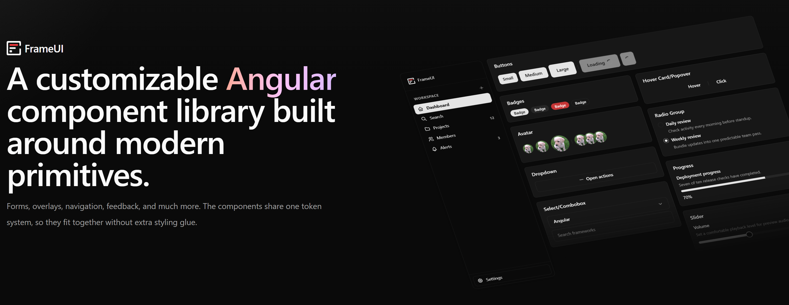

# FrameUI

--- 

A customizable Angular component library built around modern primitives.

---

# Documentation

Visit [https://frame-ui.com](https://frame-ui.com) for documentation.

--- 

# License

Licensed under the [MIT License](LICENSE.md)